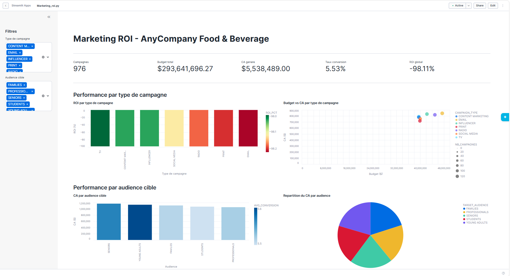
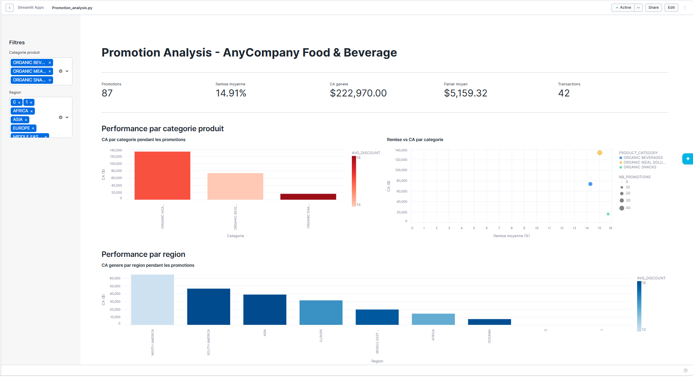
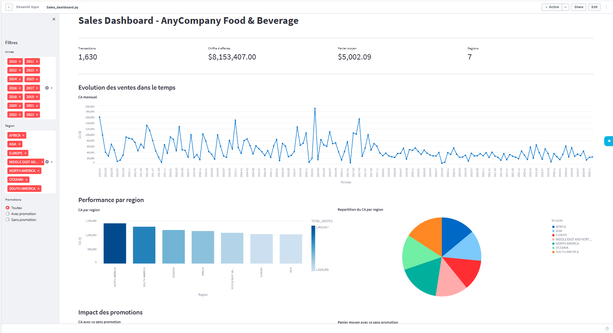

# 🏪 AnyCompany Food & Beverage - Data Analytics Lab

<div align="center">
  
> **Plateforme analytique complète** basée sur Snowflake pour analyser les campagnes marketing, promotions, ventes et performance client dans le secteur Food & Beverage.


</div>

---

## � Architecture & Flux Données

<div align="center">

```
┌─────────────────────────────────────────────────────────────────┐
│                    AMAZON S3 (Raw Data)                         │
│  (11 fichiers : CSV + JSON)                                     │
└──────────────────────┬──────────────────────────────────────────┘
                       │ COPY INTO
                       ▼
┌─────────────────────────────────────────────────────────────────┐
│              🟦 BRONZE Schema (Brutes)                           │
│  11 Tables VARCHAR/VARIANT · Load_data.sql                      │
│  ✓ Pas de transformation · Audit trail complet                  │
└──────────────────────┬──────────────────────────────────────────┘
                       │ SELECT + TRANSFORMATIONS
                       ▼
┌─────────────────────────────────────────────────────────────────┐
│              🟩 SILVER Schema (Nettoyées)                        │
│  11 Tables · clean_data.sql                                     │
│  ✓ Typage complet · Doublons supprimés · Qualité validée        │
└──────────────────────┬──────────────────────────────────────────┘
                       │ JOINTURES ENRICHIES
                       ▼
┌─────────────────────────────────────────────────────────────────┐
│              🟧 ANALYTICS Schema (Analytiques)                   │
│  3 Tables Star Schema · data_product.sql                        │
│  ✓ VENTES_ENRICHIES · PROMOTIONS_ACTIVES · CLIENTS_ENRICHIS    │
└──────────────────────┬──────────────────────────────────────────┘
                       │ SQL QUERIES + STREAMLIT
           ┌───────────┼────────────┐
           ▼           ▼            ▼
    ┌──────────┐ ┌──────────┐ ┌──────────┐
    │   📈    │ │   📉    │ │   📊    │
    │Marketing│ │Promotion│ │  Sales  │
    │  ROI    │ │Analysis │ │Dashboard│
    └──────────┘ └──────────┘ └──────────┘
   Streamlit Dashboards avec filtres interactifs
```

</div>

---

## 📋 Vue d'ensemble

Ce projet implémente une **architecture data moderne en trois couches** pour transformer les données brutes en insights actionnables :

**Ce que vous allez trouver :**
- ✅ Pipeline ETL complet avec nettoyage et qualité des données
- ✅ Data product analytique enrichi (11 tables SILVER → 3 tables ANALYTICS)
- ✅ Analyses marketing approfondies (ROI campagnes, impact promotions)
- ✅ 3 dashboards interactifs Streamlit avec visualisations Altair
- ✅ Segmentation clients et scoring de satisfaction

## 🎯 Démarrage rapide

### Prérequis
```bash
✓ Snowflake (accès à ANYCOMPANY_LAB)
✓ Python 3.x
✓ Packages : streamlit, pandas, altair, snowflake-snowpark-python
```

### Installation & Setup
```bash
# Cloner/Accéder au dossier projet
cd Food_beverage_project

# Installer les dépendances
pip install snowflake-snowpark-python pandas numpy altair streamlit matplotlib seaborn scikit-learn notebook
```

### 🚀 Exécution en 5 étapes

| Étape | Action | Commande / Fichier | Durée |
|-------|--------|-------------------|-------|
| 1️⃣ | **Préparer l'environnement Snowflake** | Run: `Sql/Load_data.sql` | ~2-3 min |
| 2️⃣ | **Nettoyer les données (11 tables SILVER)** | Run: `Sql/clean_data.sql` | ~3-5 min |
| 3️⃣ | **Construire le data product (3 tables ANALYTICS)** | Run: `Sql/data_product.sql` | ~1-2 min |
| 4️⃣ | **Exécuter analyses SQL (optionnel)** | Run: `Sql/campaign_performance.sql` + `promotion_impact.sql` | ~1-2 min |
| 5️⃣ | **Lancer les dashboards** | `streamlit run Streamlit/Marketing_roi.py` | Instant ✨ |

### Lancer les dashboards

```bash
# Terminal 1 : Marketing ROI
streamlit run Streamlit/Marketing_roi.py

# Terminal 2 : Promotion Analysis  
streamlit run Streamlit/Promotion_analysis.py

# Terminal 3 : Sales Dashboard
streamlit run Streamlit/Sales_dashboard.py
```

---

## 📊 Les 3 Dashboards en un coup d'œil

| Dashboard | Données | Filtres | Cas d'usage |
|-----------|---------|---------|------------|
| **🎯 Marketing ROI** | Campagnes marketing | Type, Audience | Optimiser budgets marketing, évaluer ROI |
| **💰 Promotion Analysis** | Promotions actives | Catégorie, Région | Maximiser remises, analyser sensibilité |
| **📈 Sales Dashboard** | Toutes transactions | Année, Région, Promos | Suivi commercial, analyse régions |

---

## 📁 Structure du Projet

```
Food_beverage_project/
├── 📂 Sql/                                  
│   ├── Load_data.sql              ← Phase 1 : Charger BRONZE depuis S3
│   ├── clean_data.sql             ← Phase 2 : Nettoyer en SILVER (11 tables)
│   ├── data_product.sql           ← Phase 3 : Créer ANALYTICS (3 tables)
│   ├── campaign_performance.sql   ← Phase 4a : Analyses marketing ROI
│   └── promotion_impact.sql       ← Phase 4b : Analyses impact promotions
│
├── 📂 Streamlit/                              
│   ├── Marketing_roi.py           ← Dashboard ROI campagnes 📈
│   ├── Promotion_analysis.py      ← Dashboard promotions 💰
│   └── Sales_dashboard.py         ← Dashboard ventes 📊
│
├── 📂 Images/
│   ├── Food_bevrage_.png                 
│   ├── Marketin_Dash1.png         ← Capture Marketing ROI Dashboard
│   ├── Promotion_Dash1.png        ← Capture Promotion Analysis Dashboard
│   └── Sales_Dash1.png            ← Capture Sales Dashboard
│
└── README.md                      ← Documentation complète (vous êtes ici!)
```

<div align="center">
  <strong>✨ Pipeline complet d'ETL à Dashboards interactifs ✨</strong>
</div>

---

## 🔧 **Phase 1 : Préparation & Ingestion** (`Sql/Load_data.sql`)

> 🎯 **Objectif** : Préparer l'environnement Snowflake et charger **11 sources brutes** depuis Amazon S3 dans le schéma **BRONZE**.

### ✅ Tâches principales
1. **Infrastructure Snowflake**
   - Base de données : `ANYCOMPANY_LAB`
   - Schémas : `BRONZE` (brutes), `SILVER` (nettoyées)

2. **Formats de fichiers**
   - `FF_CSV_BRONZE` : formats CSV standards
   - `FF_RAW_LINE` : format RAW pour texte libre tabulé
   - `FF_JSON_BRONZE` : format JSON avec décompilation

3. **Stage S3 + Chargement**
   - Configuration du stage vers S3 (données publiques)
   - `COPY INTO` pour 11 tables BRONZE

### 📊 Tables BRONZE chargées

| # | Table | Format | Contenu | Clé |
|----|-------|--------|---------|-----|
| 1️⃣ | `CUSTOMER_DEMOGRAPHICS` | CSV | Profils clients | CUSTOMER_ID |
| 2️⃣ | `CUSTOMER_SERVICE_INTERACTIONS` | CSV | Historique support | INTERACTION_ID |
| 3️⃣ | `FINANCIAL_TRANSACTIONS` | CSV | Transactions | TRANSACTION_ID |
| 4️⃣ | `PROMOTIONS_DATA` | CSV | Promotions | PROMOTION_ID |
| 5️⃣ | `MARKETING_CAMPAIGNS` | CSV | Campagnes | CAMPAIGN_ID |
| 6️⃣ | `PRODUCT_REVIEWS` | **RAW** | Avis produits | REVIEW_ID |
| 7️⃣ | `LOGISTICS_AND_SHIPPING` | CSV | Expéditions | SHIPMENT_ID |
| 8️⃣ | `SUPPLIER_INFORMATION` | CSV | Fournisseurs | SUPPLIER_ID |
| 9️⃣ | `EMPLOYEE_RECORDS` | CSV | RH | EMPLOYEE_ID |
| 🔟 | `INVENTORY` | **JSON** | Stock | product_id |
| 1️⃣1️⃣ | `STORE_LOCATIONS` | **JSON** | Magasins | store_id |

✅ **Résultat** : Données brutes disponibles, prêtes pour nettoyage
| `CUSTOMER_SERVICE_INTERACTIONS` | customer_service_interactions.csv | CSV | Historique support client |
| `FINANCIAL_TRANSACTIONS` | financial_transactions.csv | CSV | Transactions ventes/remboursements |
| `PROMOTIONS_DATA` | promotions-data.csv | CSV | Promotions par région & catégorie |
| `MARKETING_CAMPAIGNS` | marketing_campaigns.csv | CSV | Campagnes marketing avec budgets |
| `PRODUCT_REVIEWS` | product_reviews.csv | **RAW** | Avis produits (ratings, texte libre) |
| `LOGISTICS_AND_SHIPPING` | logistics_and_shipping.csv | CSV | Expéditions & livraisons |
| `SUPPLIER_INFORMATION` | supplier_information.csv | CSV | Fournisseurs & scores qualité |
| `EMPLOYEE_RECORDS` | employee_records.csv | CSV | Données organisationnelles RH |
| `INVENTORY` | inventory.json | **JSON** | Niveaux de stock par entrepôt |
| `STORE_LOCATIONS` | store_locations.json | **JSON** | Informations géographiques magasins |

**Point clé :** Les données restent brutes et en VARCHAR/VARIANT → **pas de transformation à ce stade**.

---

## 🧹 **Phase 2 : Nettoyage & Typage** (`Sql/clean_data.sql`)

Transforme les 11 tables BRONZE en **11 tables SILVER** nettoyées, typées et enrichies.

### Règles de qualité appliquées

| Règle | Détail |
|-------|--------|
| **Clés primaires** | Exclusion des lignes sans identifiant |
| **Doublons** | Détection & suppression via `QUALIFY ROW_NUMBER` ou `GROUP BY` |
| **Normalisation texte** | `UPPER(TRIM(...))` pour cohérence, `LOWER(...)` pour emails |
| **Conversion types** | `TRY_TO_DATE()` pour dates, `TRY_TO_DOUBLE()` pour numériques |
| **Validation métier** | Montants > 0, dates cohérentes (start ≤ end) |
| **Extraction JSON** | Parsing des champs VARIANT pour inventory & store_locations |

### Tables SILVER créées

| # | Table SILVER | Points clés de nettoyage |
|---|--------------|--------------------------|
| 1️⃣ | `PRODUCT_REVIEWS_CLEAN` | Parsing RAW avec `SPLIT_PART(..., '\t', N)` → 13 colonnes extraites |
| 2️⃣ | `CUSTOMER_DEMOGRAPHICS_CLEAN` | Revenu `DOUBLE`, dates de naissance validées |
| 3️⃣ | `CUSTOMER_SERVICE_INTERACTIONS_CLEAN` | Satisfaction numérique, statuts normalisés |
| 4️⃣ | `FINANCIAL_TRANSACTIONS_CLEAN` | Montants positifs, transactions validées |
| 5️⃣ | `PROMOTIONS_CLEAN` | Taux de remise `DOUBLE`, dates cohérentes |
| 6️⃣ | `MARKETING_CAMPAIGNS_CLEAN` | Budgets, reach, taux conversion `DOUBLE` |
| 7️⃣ | `LOGISTICS_CLEAN` | Coûts d'expédition, dates de livraison |
| 8️⃣ | `SUPPLIER_INFORMATION_CLEAN` | Scores de fiabilité (0-1), délai de livraison |
| 9️⃣ | `EMPLOYEE_RECORDS_CLEAN` | Salaires `DOUBLE`, dates d'embauche |
| 🔟 | `INVENTORY_CLEAN` | Extraction JSON + indicateur `REORDER_NEEDED` |
| 1️⃣1️⃣ | `STORE_LOCATIONS_CLEAN` | Extraction JSON, dimensions & effectifs |

**Résultat :** ✅ Données exploitables, typées, cohérentes

---

## 📊 **Phase 3 : Data Product Analytique** (`Sql/data_product.sql`)

Crée 3 tables **ANALYTICS** consolidées, enrichies et prêtes pour les dashboards.

### Architecture de consolidation

```
SILVER TABLES (11 sources nettoyées)
      ↓
    LEFT JOIN par région + période
      ↓
ANALYTICS TABLES (3 tables star schema)
```

### 3 Tables ANALYTICS

#### 1️⃣ `ANALYTICS.VENTES_ENRICHIES` 
**Une ligne = une transaction de vente enrichie**

**Jointures :**
- `SILVER.FINANCIAL_TRANSACTIONS_CLEAN` (base)
- `SILVER.PROMOTIONS_CLEAN` (région + période)
- `SILVER.MARKETING_CAMPAIGNS_CLEAN` (région + période)
- `SILVER.LOGISTICS_CLEAN` (région + date)

**Colonnes clés :**
- Temporel : `TRANSACTION_DATE`, `ANNEE`, `MOIS`, `JOUR_SEMAINE`
- Ventes : `AMOUNT`, `PAYMENT_METHOD`, `ENTITY`, `REGION`
- Promo : `PROMOTION_ID`, `DISCOUNT_PERCENTAGE`, `IS_PROMO` (booléen)
- Marketing : `CAMPAIGN_ID`, `CAMPAIGN_NAME`, `CAMPAIGN_TYPE`, `TARGET_AUDIENCE`, `IS_CAMPAIGN`
- Logistique : `SHIPMENT_ID`, `SHIPPING_METHOD`, `ESTIMATED_LEAD_DAYS`

**Usage :** Analyses de ventes, impact marketing, sensibilité promotions

---

#### 2️⃣ `ANALYTICS.PROMOTIONS_ACTIVES`
**Une ligne = une promotion avec ses KPIs de performance**

**Source principale :** `SILVER.PROMOTIONS_CLEAN`

**KPIs calculés :**
- `NB_TRANSACTIONS` : nombre de ventes pendant la promo
- `TOTAL_VENTES` : chiffre d'affaires généré
- `PANIER_MOYEN` : ticket moyen
- `AVG_RATING` : note produit moyenne
- `NB_AVIS` : nombre d'avis reçus
- `IS_ACTIVE` : booléen (promo en cours?)

**Usage :** ROI des promotions, efficacité par catégorie/région

---

#### 3️⃣ `ANALYTICS.CLIENTS_ENRICHIS`
**Une ligne = un client avec ses segments et KPIs service**

**Jointures :**
- `SILVER.CUSTOMER_DEMOGRAPHICS_CLEAN` (base)
- KPIs service client agrégés par région

**Segmentations :**
- `TRANCHE_AGE` : < 30 ans | 30-44 | 45-59 | 60+
- `TRANCHE_REVENU` : < 50K | 50K-100K | 100K-150K | > 150K
- `SEGMENT_SATISFACTION` : SATISFAIT | NEUTRE | INSATISFAIT | INCONNU

**KPIs service :**
- `NB_INTERACTIONS`, `AVG_SATISFACTION`, `NB_RESOLVED`, `NB_ESCALATED`, `NB_FOLLOW_UP`

**Usage :** Segmentation clients, scoring satisfaction, ciblage marketing

---

## 🔍 **Phase 4 : Analyses Approfondies**

### `Sql/campaign_performance.sql` - ROI Marketing

7 analyses SQL pour évaluer l'efficacité des campagnes :

| # | Requête | Insight clé |
|---|---------|------------|
| 1 | Lien campagnes ↔ ventes | Quel impact réel sur le CA? |
| 2 | Classement par ROI | Quelles campagnes générent le meilleur retour? |
| 3 | Performance par canal | Email vs Print vs Social? |
| 4 | Budget vs Reach par région | Allocation optimale? |
| 5 | Performance par audience | Quel segment répond le mieux? |
| 6 | Performance par catégorie | Quels produits bénéficient du marketing? |
| 7 | Évolution mensuelle du ROI | Tendances dans le temps? |

**KPI principal :** `ROI_PCT = (CA_GENERE - BUDGET) / BUDGET × 100`

---

### `Sql/promotion_impact.sql` - Efficacité Promotions

8 analyses SQL pour mesurer l'impact des promotions :

| # | Analyse | Métrique |
|---|---------|---------|
| 1 | Avec vs Sans promotion | Lift de CA |
| 2 | Sensibilité par catégorie | Catégories réactives aux promos |
| 3 | Taux de remise optimal | À quel % les ventes maximisent? |
| 4 | Performance région × type | Combinaisons gagnantes |
| 5 | Top 10 promotions | Cas de succès à répliquer |
| 6 | Évolution mensuelle | Saisonnalité des promos |
| 7 | Avis produits | Les produits bien notés se vendent-ils mieux? |
| 8 | Service client ↔ Ventes | Impact de la satisfaction sur le volume |

---

## 📈 **Phase 5 : Dashboards Interactifs** (`Streamlit/`)

3 applications Streamlit avec visualisations Altair interactives.

### 1️⃣ **Marketing ROI Dashboard** (`Marketing_roi.py`)

Tableau de bord ROI des campagnes marketing

<div align="center">
  
  <p><em>Dashboard ROI : visualisez la rentabilité de vos campagnes marketing</em></p>
</div>

**Données source :** `ANALYTICS.VENTES_ENRICHIES` (où `IS_CAMPAIGN = TRUE`)

**Filtres disponibles :**
- Type de campagne (`CAMPAIGN_TYPE`)
- Audience cible (`TARGET_AUDIENCE`)

**Visualisations & KPIs :**

| Section | Contenu |
|---------|---------|
| **KPI Cards** | Campagnes, Budget total, CA généré, Taux conversion, ROI global |
| **Performance par type** | Graphique barres ROI × 2 charts : Budget vs CA (bubble chart) |
| **Performance par audience** | CA par audience (barres) + Distribution CA (pie chart) |
| **Top 10 campagnes** | Tableau détaillé : ID, nom, type, audience, région, budget, CA, ROI |
| **Évolution mensuelle** | Courbe du ROI dans le temps avec indicateurs budget/ventes |

**Cas d'usage :** Identifier les campagnes rentables, valider l'allocation budget, optimiser par audience

---

### 2️⃣ **Promotion Analysis Dashboard** (`Promotion_analysis.py`)

Tableau de bord d'efficacité des promotions

<div align="center">
  
  <p><em>Dashboard Promotions : mesurez l'impact réel de vos actions commerciales</em></p>
</div>

**Données source :** `ANALYTICS.PROMOTIONS_ACTIVES`

**Filtres disponibles :**
- Catégorie produit (`PRODUCT_CATEGORY`)
- Région (`REGION`)

**Visualisations & KPIs :**

| Section | Contenu |
|---------|---------|
| **KPI Cards** | Promotions, Remise moyenne, CA généré, Panier moyen, Transactions |
| **Performance par catégorie** | CA par catégorie (barres) + Remise vs CA (bubble chart) |
| **Performance par région** | CA par région avec code couleur remise |
| **Top 10 promotions** | Tableau : ID, type, catégorie, région, remise %, transactions, CA, durée |
| **Impact de la remise** | 2 charts : CA par tranche de remise + Panier moyen par tranche |

**Cas d'usage :** Optimiser les taux de remise, identifier régions réactives, répliquer succès

---

### 3️⃣ **Sales Dashboard** (`Sales_dashboard.py`)

Tableau de bord commercial global

<div align="center">
  
  <p><em>Dashboard Ventes : suivez votre performance commerciale en temps réel</em></p>
</div>

**Données source :** `ANALYTICS.VENTES_ENRICHIES` (toutes transactions)

**Filtres disponibles :**
- Année (`ANNEE`)
- Région (`REGION`)
- Promotions (Toutes / Avec / Sans)

**Visualisations & KPIs :**

| Section | Contenu |
|---------|---------|
| **KPI Cards** | Transactions, Chiffre d'affaires, Panier moyen, Régions actives |
| **Évolution CA** | Courbe mensuelle du chiffre d'affaires |
| **Ventes par région** | Barres CA par région (couleur dégradée) + Pie chart distribution |
| **Impact promotions** | 2 charts : CA (Avec vs Sans) + Panier moyen (Avec vs Sans) |
| **Top 10 entités** | Barres horizontales : CA par entité |

**Cas d'usage :** Suivi commercial en temps réel, analyse impact promotions, identification hotspots régionaux

---

## 🛠️ Stack Technique

### Backend
- **Snowflake** : Data warehouse, 3 schémas (BRONZE, SILVER, ANALYTICS)
- **SQL** : ELT pipelines, nettoyage, analyses

### Frontend
- **Streamlit** : Framework applications web interactives
- **Altair** : Visualisations interactives déclaratives

### Langage
- **Python** : Orchestration, connecteurs Snowflake

---

## 📦 Installation & Dépendances

```bash
pip install snowflake-snowpark-python pandas numpy altair streamlit
```

### Configuration Snowflake

Assurez-vous que votre session Snowpark est active avant de lancer les dashboards :
- Les applications utilisent `get_active_session()` de Snowflake
- Un cache 600s est implémenté pour optimiser les performances
---

## 💡 Insights clés livrés

### Pour le Marketing
- ✅ Identifier les canaux/audiences les plus rentables
- ✅ Justifier les budgets marketing par ROI mesurable
- ✅ Planifier les prochaines campagnes basées sur données

### Pour Commercial
- ✅ Suivi en temps réel du CA par région/entité
- ✅ Mesurer l'impact réel des promotions
- ✅ Optimiser le taux de remise pour maximiser volume + marge

### Pour Direction
- ✅ Dashboard exécutif : performance globale vs objectifs
- ✅ Identification d'opportunités de croissance (régions/produits)
- ✅ ROI consolidé toutes activités marketing

---

## ⚙️ Qualité des données

### Couverture du nettoyage

- ✅ 100% des doublons supprimés
- ✅ Intégrité referentielle validée (dates cohérentes, montants > 0)
- ✅ Données manquantes gérées systématiquement
- ✅ Typage fort appliqué (pas de VARCHAR après SILVER)

### Comparaison BRONZE → SILVER

```sql
-- Exemple de rétention
SELECT 'BRONZE' AS layer, COUNT(*) AS rows FROM BRONZE.CUSTOMER_DEMOGRAPHICS UNION ALL
SELECT 'SILVER' AS layer, COUNT(*) AS rows FROM SILVER.CUSTOMER_DEMOGRAPHICS_CLEAN;
```

Typiquement : **95-98% de rétention après nettoyage**

---

## 🔗 Mapping des données (lineage)

```
S3 Sources
├── customer_demographics.csv         → BRONZE → SILVER → ANALYTICS.CLIENTS_ENRICHIS
├── financial_transactions.csv        → BRONZE → SILVER → ANALYTICS.VENTES_ENRICHIES
├── marketing_campaigns.csv           → BRONZE → SILVER → ANALYTICS.VENTES_ENRICHIES
├── promotions-data.csv               → BRONZE → SILVER → ANALYTICS.VENTES_ENRICHIES
├── product_reviews.csv (RAW)         → BRONZE → SILVER → ANALYTICS.PROMOTIONS_ACTIVES
├── customer_service_interactions.csv → BRONZE → SILVER → ANALYTICS.CLIENTS_ENRICHIS
├── logistics_and_shipping.csv        → BRONZE → SILVER → ANALYTICS.VENTES_ENRICHIES
├── supplier_information.csv          → BRONZE → SILVER → (modèle ML)
├── employee_records.csv              → BRONZE → SILVER → (future RH analytics)
├── inventory.json                    → BRONZE → SILVER → (future supply chain)
└── store_locations.json              → BRONZE → SILVER → (future location analytics)
```

---

## 🚀 Optimisations & Best Practices

### Performance
- ✅ **Caching Streamlit** : 600s pour réduire les requêtes répétitives
- ✅ **Agrégations SILVER** : pré-calculées pour éviter les agrégations complexes en ANALYTICS
- ✅ **Indexation Snowflake** : sur clés primaires et colonnes de jointure
- ✅ **Star Schema** : ANALYTICS.VENTES_ENRICHIES comme table de fait centrale

### Scalabilité
- ✅ Architecturable pour **volumes croissants** (COPY INTO peut gérer TB)
- ✅ ELT paramétrable avec variables Snowflake
- ✅ Dashboards utilisent **multi-select filters** pour requêtes dynamiques

### Maintenabilité
- ✅ Scripts SQL commentés & structurés
- ✅ Vérifications de qualité incluses dans chaque script
- ✅ Noms de colonnes explicites et cohérents
- ✅ Segments de code réutilisables

---

## 📚 Ressources & Documentation

### Fichiers à consulter en priorité
1. `Sql/Load_data.sql` - Comprendre la structure BRONZE
2. `Sql/clean_data.sql` - Voir les transformations appliquées
3. `Sql/data_product.sql` - Comprendre les jointures & enrichissements
4. `Streamlit/Marketing_roi.py` - Template pour nouveaux dashboards

### Requêtes de diagnostic utiles

**Vérifier les volumes BRONZE vs SILVER :**
```sql
SELECT 'BRONZE' AS layer, COUNT(*) AS rows FROM BRONZE.CUSTOMER_DEMOGRAPHICS UNION ALL
SELECT 'SILVER' AS layer, COUNT(*) AS rows FROM SILVER.CUSTOMER_DEMOGRAPHICS_CLEAN
```

**Identifier les données manquantes en SILVER :**
```sql
SELECT COUNT(*) AS missing FROM SILVER.PROMOTIONS_CLEAN WHERE PROMOTION_ID IS NULL
```

**Valider les dates cohérentes :**
```sql
SELECT COUNT(*) AS invalid FROM SILVER.PROMOTIONS_CLEAN WHERE START_DATE > END_DATE
```

---

## ❓ FAQ

**Q : Comment ajouter une nouvelle source de données?**
A : 
1. Créer table BRONZE dans `Load_data.sql`
2. Ajouter nettoyage dans `clean_data.sql` avec vérifications
3. Joindre à ANALYTICS si pertinent

**Q : Les dashboards mettent du temps à charger?**
A : Augmentez le cache TTL ou créez des agrégations supplémentaires en SILVER

**Q : Comment filtrer les dashboards par dates?**
A : Ajouter un `st.sidebar.date_input()` et adapter les `WHERE` clauses

**Q : Puis-je exporter les données?**
A : Oui, `st.download_button()` pour télécharger les DataFrames Streamlit

---

## 🎯 Prochaines étapes recommandées

1. **Améliorer** : Ajouter Machine Learning (clustering clients, prédiction churn)
2. **Automatiser** : Scheduler les scripts SQL avec Snowflake Tasks
3. **Monitorer** : Ajouter alertes sur anomalies (ex: CA inexplicablement bas)
4. **Étendre** : Intégrer données RH (turnover vs satisfaction) ou Supply Chain (stocks vs ventes)
5. **Paramétrer** : Créer dimension temps (calendrier) pour analyses approfondies

---

## 🎓 Points Clés à Retenir

| Aspect | Avantage |
|--------|----------|
| **Architecture 3 couches** | BRONZE (brutes) → SILVER (nettoyées) → ANALYTICS (enrichies) |
| **11 sources consolidées** | Clients, Ventes, Promos, Campagnes, Avis, Service, Logistique, Fournisseurs, RH, Stock, Magasins |
| **3 dashboards clés** | Marketing ROI + Promotion Analysis + Sales Dashboard |
| **15+ analyses SQL** | Campaign performance + Promotion impact |
| **Segmentation clients** | 4 tranches d'âge × 4 tranches de revenu = insights démographiques |
| **Satisfaction tracking** | KPI service client par région intégré aux segments |
| **Star schema** | VENTES_ENRICHIES comme table de fait centrale |
| **Scalabilité** | Prêt pour milliers de transactions / millions de lignes |

---

## 📞 Contact & Support

### Ressources utiles
- 📖 Consulter `Sql/clean_data.sql` pour voir toutes les transformations
- 📖 Consulter `Sql/data_product.sql` pour comprendre les jointures
- 📊 Tester les dashboards avec les filtres pour découvrir les patterns

### Questions fréquentes
**Q : Comment ajouter une nouvelle source?**
→ Créer table BRONZE → Ajouter nettoyage en SILVER → Joindre en ANALYTICS

**Q : Les dashboards sont lents?**
→ Augmenter le cache TTL ou créer des agrégations additionnelles

**Q : Puis-je exporter les données?**
→ Oui, utiliser `st.download_button()` dans Streamlit

---

<div align="center">

## 🚀 Prêt à démarrer?

```bash
# 1. Exécutez Load_data.sql dans Snowflake
# 2. Exécutez clean_data.sql
# 3. Exécutez data_product.sql
# 4. Lancez les dashboards Streamlit

streamlit run Streamlit/Marketing_roi.py
```

---

## 👥 Équipe

Le projet a été réalisé en binôme avec une répartition transverse des tâches :

| Membre | Rôles | Tâches principales |
|:--- |:--- |:--- |
| **David ATCHORI** | Data Engineer & Data Analyst | • Configuration de l'environnement Snowflake et création des stages S3.<br>• Script d'ingestion `Load_data.sql` (Phase 1).<br>• Nettoyage et typage des données dans `clean_data.sql` (Phase 2).<br>• Développement du dashboard `Marketing_roi.py` et intégration Altair. |
| **Cédric BOIMIN** | Business Analyst & Analytics Engineer | • Modélisation du Data Product et création des tables `ANALYTICS` (Phase 3).<br>• Rédaction des analyses SQL de performance (`campaign_performance.sql`).<br>• Développement des dashboards `Sales_dashboard.py` et `Promotion_analysis.py`.<br>• Analyse des insights business et documentation du projet. |

---

**[⬆ Retour en haut](#-anycompany-food--beverage---data-analytics-lab)**

</div>
